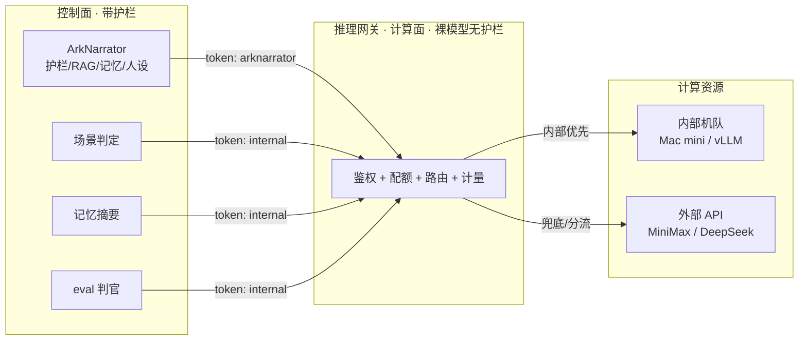

# 推理网关：控制面 / 计算面分离

把推理机队做成独立的、token 鉴权的 OpenAI 兼容服务，控制面（ArkNarrator）只是它的一个调用方。
好处：① 空闲算力可被多个消费者复用并分账；② 产品/安全逻辑与裸推理各自演进；③ 内部机队与外部
API 混合调度（内部优先、外部兜底/分流）。

## 架构



- **控制面**：所有安全护栏（涉政/未成年/出戏/泄露）、RAG、长期记忆、人设、编排。面向用户的内容**必须**从这里出。
- **计算面（网关）**：纯推理转发，自己**不做内容安全**。负责鉴权、按 token 限流/配额、路由、计量。
- **计算资源**：内部 Mac 机队（Redis 服务发现 + LB + 故障转移 + 熔断）+ 可选外部 OpenAI 兼容 API。

## ⚠️ 安全边界（最重要，务必遵守）

> 网关是**裸模型、没有任何护栏**。网关 token 只发给**内部 / 非面向用户**的消费者
> （eval、批处理、场景判定、记忆摘要、研发）。**任何面向终端用户的内容，必须先经控制面
> （带护栏）再调网关。** 绝不允许「共享模型 = 把无护栏模型直接暴露给用户」。

落地保障：① 控制面在调网关**前后**都跑护栏（输入护栏 + 输出守门 + 可选云审）；② 内部消费者
token 设 `allow_targets: [pool]`，既省外部成本也限定用途；③ 网关只在内网/受信网络暴露。

## 端点（OpenAI 兼容）

| 方法 | 路径 | 说明 |
|---|---|---|
| POST | `/v1/chat/completions` | 对话补全，支持 `stream`；响应头 `X-Served-Target` = 本次命中的上游 |
| GET | `/v1/models` | 模型列表 |
| GET | `/healthz` | 存活 + 当前 targets |
| GET | `/metrics` | Prometheus 文本（按 token/target 分） |

鉴权：`Authorization: Bearer <token>`（配了 token 才强制）。

## 路由（GW_ROUTE_* / GW_EXTERNAL_*）

- **按模型**：`GW_ROUTE_TABLE="deepseek-chat=external,ark-local=pool"`。
- **内部优先 + 外部兜底**（默认）：`GW_ROUTE_DEFAULT=pool`、`GW_ROUTE_FALLBACK=external`；内部失败/无健康节点自动转外部。
- **百分比分流**：`GW_EXTERNAL_SPLIT=0.2` → 20% 走外部优先（A/B、限内部负载、难任务上外部强模型）。
- **跨上游故障转移**：按序尝试目标，首个成功即返回，全失败才 502。

## 配额 / 计量（多租户，每 token 一套策略）

`gateway/tokens.yaml`（见 `tokens.example.yaml`，gitignore）：

```yaml
tokens:
  - token: <强随机>
    name: arknarrator
    rate_limit: 600          # 每分钟请求数，0/缺省=不限
    daily_quota: 1000000     # 每日请求数，0/缺省=不限
    allow_targets: [pool, external]
  - token: <强随机>
    name: internal           # 场景判定/记忆/eval：限内部、低额度
    rate_limit: 120
    allow_targets: [pool]
```

- 超限 → `429`（`gw_quota_reject_total{reason=rate|quota}`）；不在 `allow_targets` → `403`。
- 计量：`gw_requests_total{token,target}`、`gw_completion_chars_total{token}`（产出量→成本归属）。

## 接入

**控制面 ArkNarrator → 网关**（`.env` / deploy/.env）：

```bash
ARK_BACKEND=api
ARK_API_BASE_URL=http://gateway:8080/v1
ARK_API_KEY=<arknarrator token>
ARK_INTERNAL_API_KEY=<internal token>    # 场景判定/记忆摘要分账走它（见 G4）
```

**部署**（compose，gateway profile）：

```bash
# deploy/.env 里设 GW_BACKEND=pool、GW_TOKENS=...、ARK_BACKEND=api、ARK_API_BASE_URL=http://gateway:8080/v1 ...
docker compose -f deploy/compose-prod.yml --profile gateway up -d --scale app=3
```

`GW_BACKEND=scripted` 可无 GPU 验证整条链路；真机队改 `pool`（节点经 Redis 自注册，见 deploy/join_cluster.sh）。
